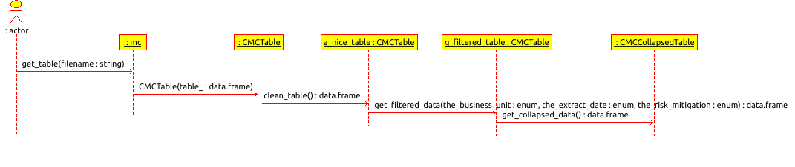
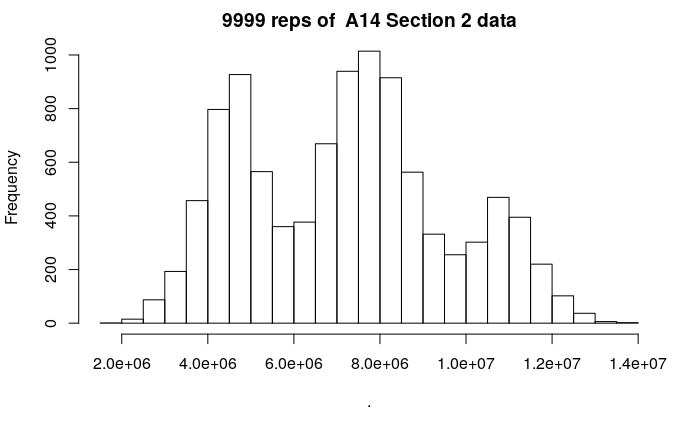

```{r setup, include=FALSE}
knitr::opts_chunk$set(echo = TRUE)
```

#  MCFC


## Why a Subcommittee?  

Why a subcommittee?  Some of the stated intentions of the data analysis meetup include 

* Wouldn't it be great to make a new Google?
* Evangelizing data science in the project management profession
* The Hack-a-Thon

It is unlikely that monte carlo techniques in risk management will have any financial viability.  But acting as if it did may help inform future groups with related initiatives.  On an individual level, demonstrating work in open source and academic projects can be a resume booster. 

There seems to be a lot of discussion about direction at the meetups but little activity between the meetups outside the formal work done by the organizers.  For the group to take on a life of its own it will be necessary for independent but coordinated efforts to be ongoing in parallel; in other words, subcommittees.  

The reasoning for the hack-a-thon is entirely parallel.  If the same challenges are given each time, then having continuity between the events allows newcomers to start from a known place instead of having to begin with a blank slate each time.

## The Oxford Discussion

Professor Alex Budzier made it very clear at the [last meetup](https://projectdataanalytics.uk/alex-budziers-presentation-to-the-london-meetup)  that he felt monte carlo analysis to be a waste of time.  Rather he promotes [Reference Class Forecasting](https://en.wikipedia.org/wiki/Reference_class_forecasting).  That since all the individual estimates are overly optimistic, that the monte carlo estimate just organizes optimism and calls it science.  His data, based on similar historical projects, shows that the type of estimates used here in the monte carlo process ignore a long tail on the top end.  


There would still seem to be value in having the monte carlo estimate, if only for comparison with historical data.  Also, a monte carlo tool that was able to incorporate information about historical data would have another unique selling proposition (USP).

## The Code

There are 4 basic steps involved in generating the estimates as the code currently stands



* Read a file of risk data
* Clean up irrelevant or suspect data
* Filter the data based on a subset of interest
* 'Collapse' the data -- i.e. generate a point value based on the stated probability in the risk and a hypothesized distribution derived from the the given (best, expected, worst) values.  This can be based on the entire set of filtered data or just a subset of that data. 

Repeat the collapsing process multiple times to build up a histogram.  Some surprises occur, such as multi-modal distributions; this is surely useful information to the project manager that is not apparent from the individual risks and would presumably aid in planning.




## More USP

Alternatives to repeating the collapsing process include creating a theoretical distribution.  This could be done as a discrete distribution (which would use normal approximation and therefore lose the multi-modality that can exist) or as a mixture model or otherwise.

The process described above assumes that all the risks are independent, which they are not.  Having some way of accounting for correlation between the risks might make the  monte carlo estimates more realistic.  This correlation might be entered manually, or it could be estimated from a sentiment analysis on comments or descriptions of the risks.

Integration with different tools (for example Primavera on the back end or Power BI on the front end) is seen as of value.

## Use Cases

For next steps, rather than diving into further technical details, it may be advantageous to define the overall process into which these calculations fit and the goals of the actors involved in the process at any given step.  In other words, to define use cases.  These would then be used to create a modular system, each module of which possesses a well defined interface and which could be elaborated on in detail.


## Links and References

* Project Data Analytics Community
    + [Website](https://projectdataanalytics.uk/)
    + [Meetups](https://skillsmatter.com/groups/10768-project-data-and-analytics)
    + [LinkedIn](https://www.linkedin.com/company/projectdataanalytics/?viewAsMember=true)
* Monte Carlos Flying Circus
    + [shinyserver.io](https://north-loop-designs.shinyapps.io/mcfc01/)
    + [Git](https://github.com/possibly-sam/mcfc01)
    + [Linked In](https://www.linkedin.com/groups/12233300/)
    + [Slack](projecthackworkspace.slack.com)  #07montecarlorisk
* [North Loop Designs](http://www.north-loop-designs.uk)
    + [Phillip e-mail](mailto:pma@north-loop-designs.uk)


